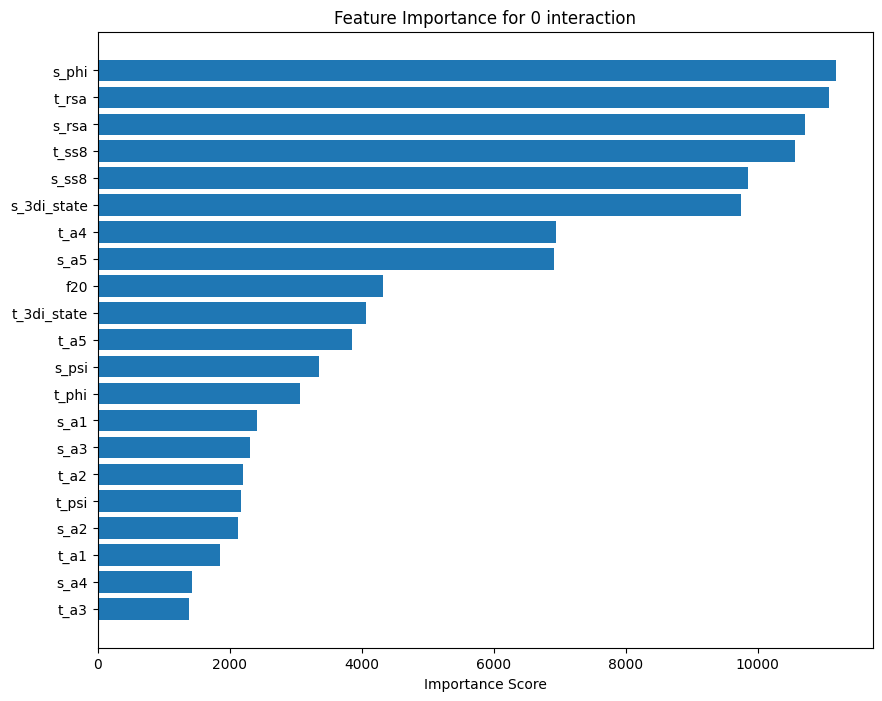
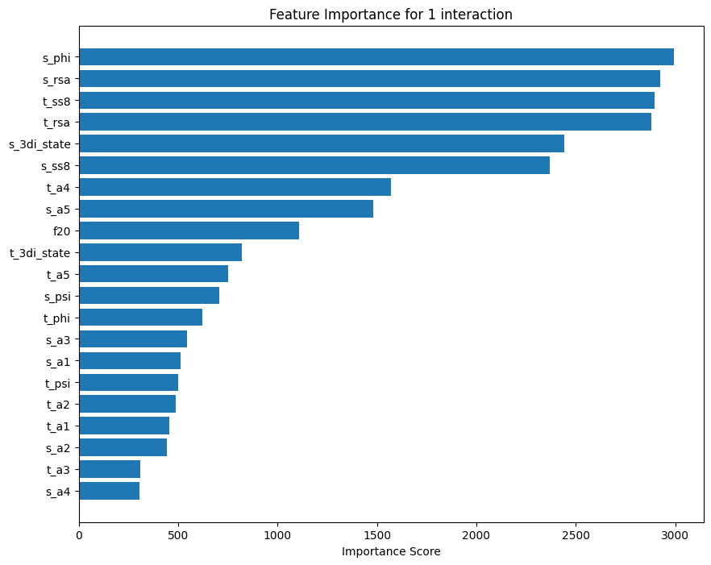
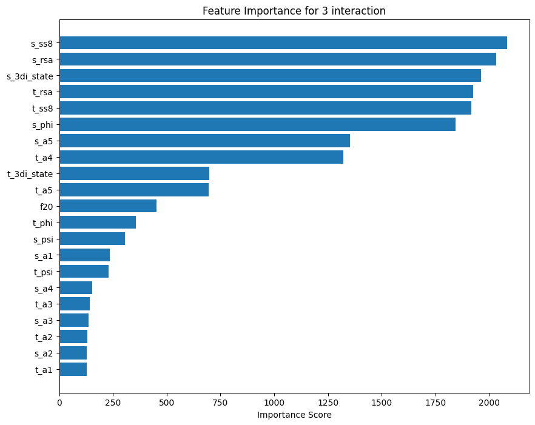
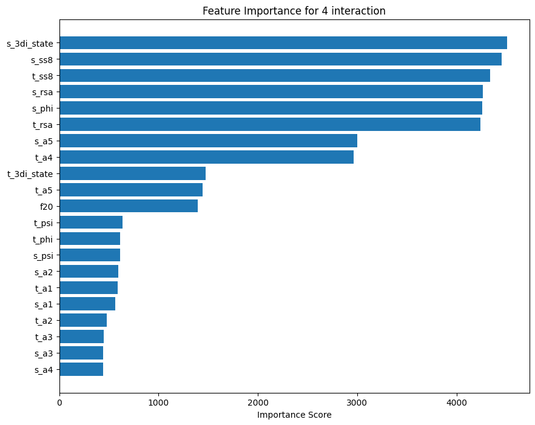
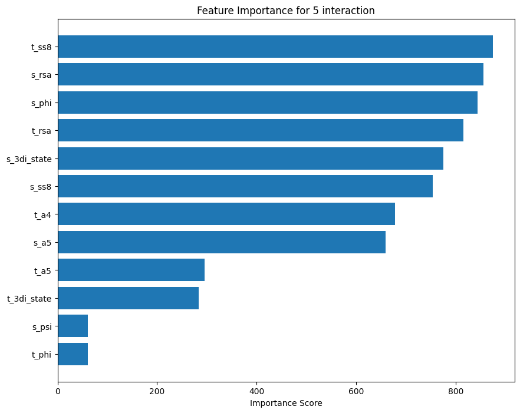
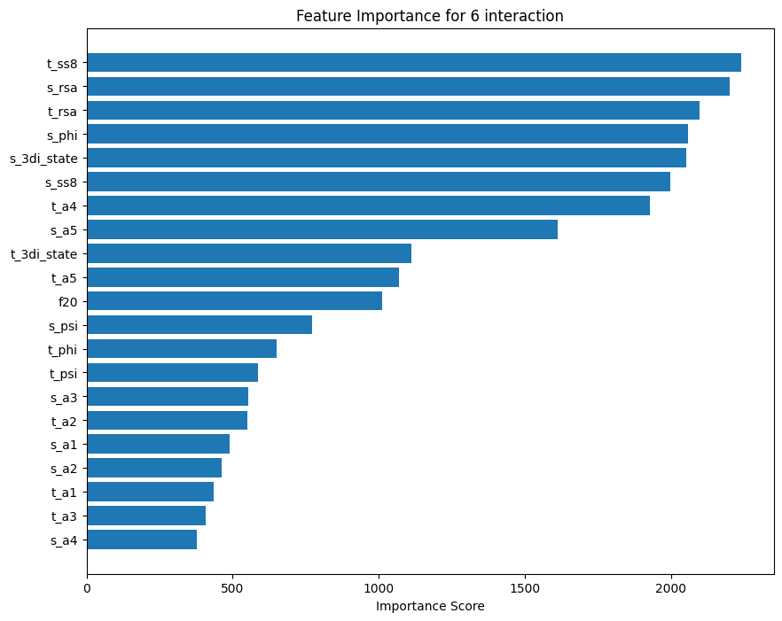
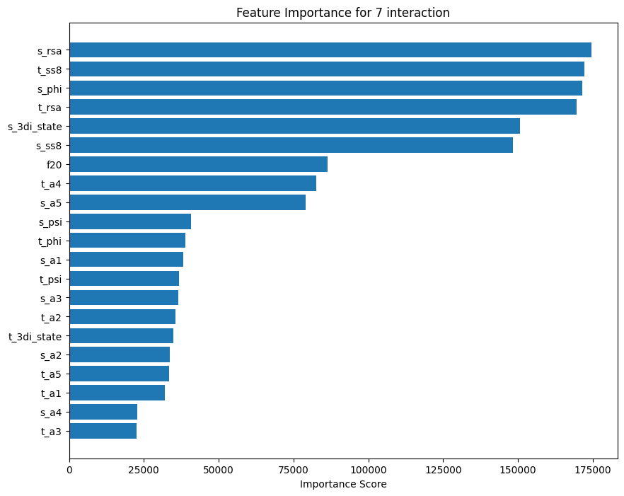

# Performance with features engineering + SMOTE

## `a5` product

| Interaction Type | Accuracy | Balanced Accuracy | Feature Importance Plot |
|------------------|----------|-------------------|------------------------|
| HBOND | 0.6766 | 0.5989 |  |
| VDW | 0.7517 | 0.5001 |  |
| PIPISTACK | 0.9867 | 0.5560 |  |
| IONIC | 0.9874 | 0.5035 |  |
| PICATION | 0.9959 | 0.5527 |  |
| SSBOND | 0.9990 | 0.7390 |  |
| PIHBOND | 0.9991 | 0.5278 |  |
| Unclassified | 0.7354 | 0.6937 |  |
