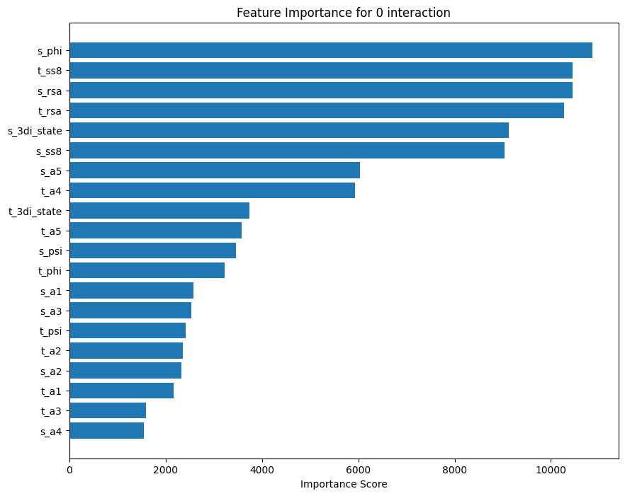
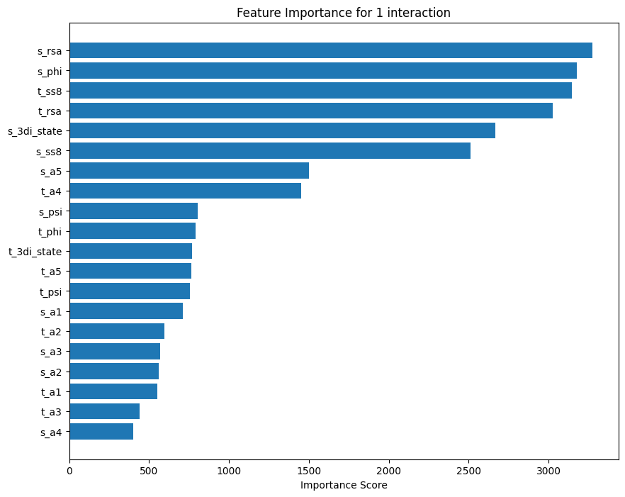
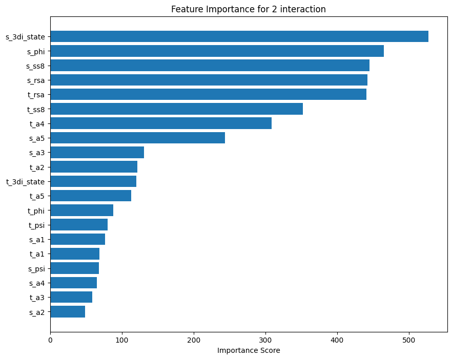
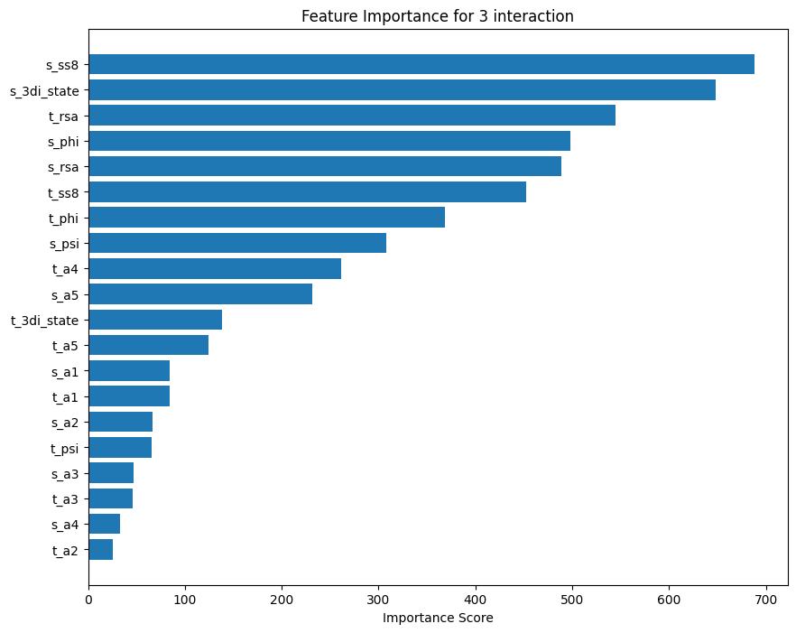
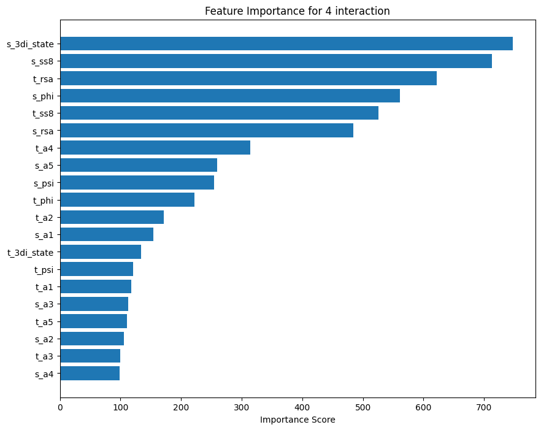
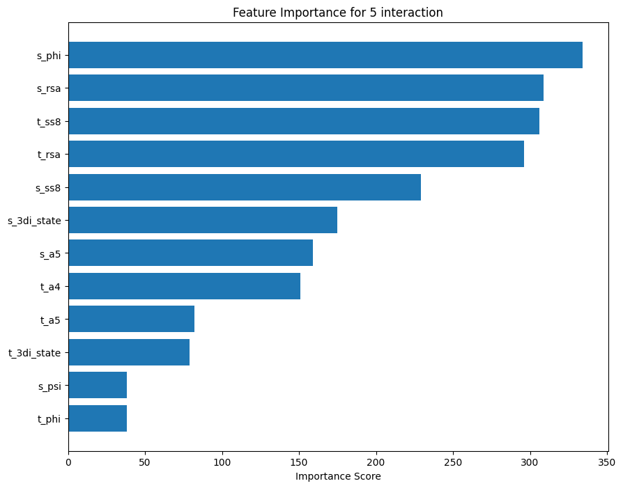
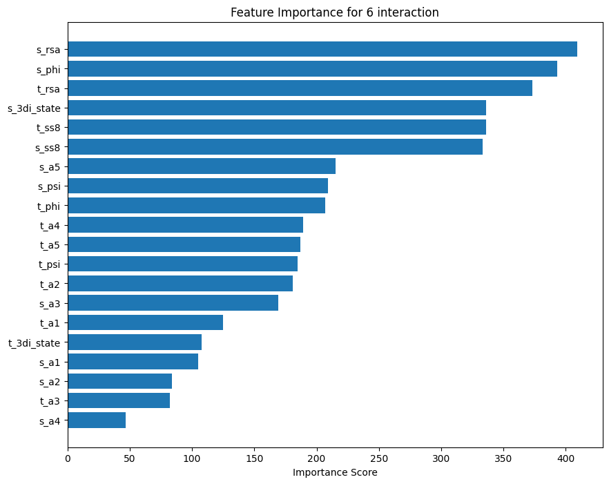
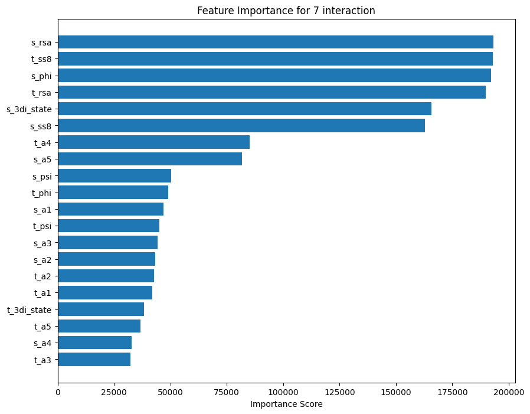
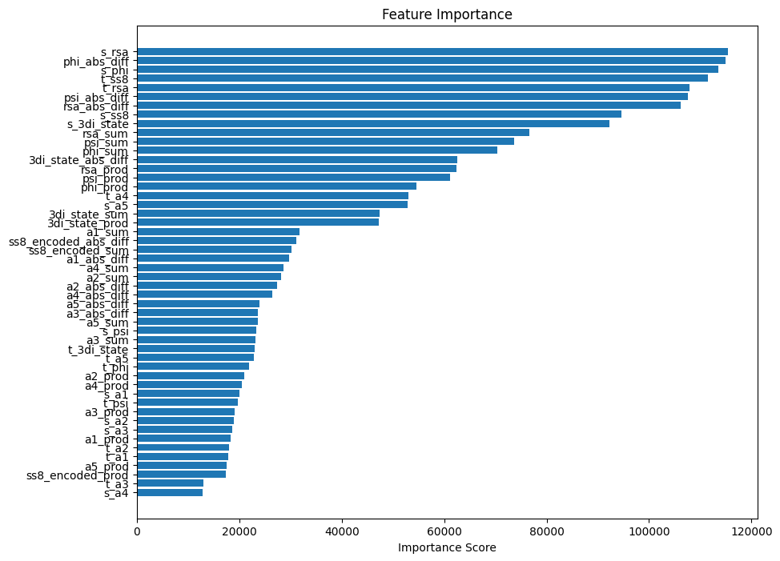

# Multiclass Classification
## Performance w/o features engineering + SMOTE
| Metric | Value |
|------------------|----------|
| Accuracy | 0.5264 |
| Balanced Accuracy | 0.5971 |
| AUC-ROC | 0.8803 |
| Matthews Correlation | 0.2837 |
| Average Precision | 0.5759 |
| Inference Time | 2921.6597 |

## Performance w/o features engineering + SMOTE (auto)
| Metric | Value |
|------------------|----------|
| Accuracy | 0.5310 |
| Balanced Accuracy | 0.3988 |
| AUC-ROC | 0.8738 |
| Matthews Correlation | 0.2786 |
| Average Precision | 0.3543 |
| Inference Time | 4563.5719 |


# One-vs-All
## Performance w/o features engineering w/o SMOTE
| Interaction Type | Accuracy | Balanced Accuracy | Feature Importance Plot |
|------------------|----------|-------------------|------------------------|
| HBOND | 0.6444 | 0.6581 |  |
| VDW | 0.5296 | 0.5378 |  |
| PIPISTACK | 0.9791 | 0.9871 |  |
| IONIC | 0.9417 | 0.9632 |  |
| PICATION |  0.9780 | 0.9522 |  |
| SSBOND | 0.9990 | 0.9852 |  |
| PIHBOND | 0.9248 | 0.8842 |  |
| Unclassified | 0.7326 | 0.7101 |  |

## Performance w/o features engineering + SMOTE
| Interaction Type | Accuracy | Balanced Accuracy | Feature Importance Plot |
|------------------|----------|-------------------|------------------------|
| HBOND | 0.6426 | 0.6581 |  |
| VDW | 0.5178 | 0.5373 |  |
| PIPISTACK | 0.9791 | 0.9874 |  |
| IONIC | 0.9420 | 0.9615 |  |
| PICATION |  0.9784 | 0.9594 |  |
| SSBOND | 0.9990 | 0.9472 |  |
| PIHBOND | 0.9666 | 0.8200 |  |
| Unclassified | 0.7320 | 0.7106 |  |


## Performance with features engineering + SMOTE

### `a5` product

Without `scale_pos_weight` parameter

| Interaction Type | Accuracy | Balanced Accuracy | Feature Importance Plot |
|------------------|----------|-------------------|------------------------|
| HBOND | 0.6766 | 0.5989 |  |
| VDW | 0.7517 | 0.5001 |  |
| PIPISTACK | 0.9867 | 0.5560 |  |
| IONIC | 0.9874 | 0.5035 |  |
| PICATION | 0.9959 | 0.5527 |  |
| SSBOND | 0.9990 | 0.7390 |  |
| PIHBOND | 0.9991 | 0.5278 |  |
| Unclassified | 0.7354 | 0.6937 |  |

With `scale_pos_weight` parameter

| Interaction Type | Accuracy | Balanced Accuracy | Feature Importance Plot |
|------------------|----------|-------------------|------------------------|
| HBOND | 0.6410 | 0.6569 |  |
| VDW | 0.5198 | 0.5349 |  |
| PIPISTACK | 0.9791 | 0.9870 |  |
| IONIC | 0.9485 | 0.9353 |  |
| PICATION | 0.9909 | 0.7615 |  |
| SSBOND | 0.9991 | 0.9115 |  |
| PIHBOND | 0.9988 | 0.5611 |  |
| Unclassified | 0.7324 | 0.7118 |  |

With `scale_pos_weight` parameter + fixed SMOTE only over training split

| Interaction Type | Accuracy | Balanced Accuracy | Feature Importance Plot |
|------------------|----------|-------------------|------------------------|
| HBOND | 0.6424 | 0.6582 |  |
| VDW | 0.5206 | 0.5366 |  |
| PIPISTACK | 0.9791 | 0.9873 |  |
| IONIC | 0.9421 | 0.9621 |  |
| PICATION | 0.9814 | 0.9211 |  |
| SSBOND | 0.9990 | 0.9614 |  |
| PIHBOND | 0.9694 | 0.7977 |  |
| Unclassified | 0.7335 | 0.7123 |  |

## Engineered all the features

For each feature (not distinguished between source and target) it was compute 4 ways to combine the features:
- sum
- absolute difference
- product
- average

| Interaction Type | Accuracy | Balanced Accuracy | Feature Importance Plot |
|------------------|----------|-------------------|------------------------|
| HBOND | 0.6422 | 0.6573 |  |
| VDW | 0.5208 | 0.5361 |  |
| PIPISTACK | 0.9791 | 0.9872 |  |
| IONIC | 0.9421 | 0.9619 |  |
| PICATION | 0.9788 | 0.9560 |  |
| SSBOND | 0.9991 | 0.9734 |  |
| PIHBOND | 0.9838 | 0.7574 |  |
| Unclassified | 0.7396 | 0.7170 |  |

| Class | Accuracy | Balanced Accuracy | AUC-ROC | Matthews Correlation | Average Precision | Feature Importance | Confusion Matrix |
|-------|----------|-------------------|---------|---------------------|-------------------|-------------------|------------------|
| 0 | 0.6439 | 0.6605 | 0.7206 | 0.3074 | 0.5565 |  |  |
| 1 | 0.5162 | 0.5382 | 0.5549 | 0.0660 | 0.2833 |  |  |
| 2 | 0.9790 | 0.9885 | 0.9910 | 0.6096 | 0.4463 |  |  |
| 3 | 0.9415 | 0.9640 | 0.9775 | 0.3944 | 0.2393 |  |  |
| 4 | 0.9764 | 0.9708 | 0.9914 | 0.3210 | 0.1835 |  |  |
| 5 | 0.9990 | 0.9876 | 0.9995 | 0.6374 | 0.4226 |  |  |
| 6 | 0.9373 | 0.9002 | 0.9525 | 0.0808 | 0.0174 |  |  |
| 7 | 0.7339 | 0.7183 | 0.7953 | 0.4329 | 0.6769 |  |  |


### features selection

| Class | Accuracy | Balanced Accuracy | AUC-ROC | Matthews Correlation | Average Precision | Feature Importance | Confusion Matrix |
|-------|----------|-------------------|---------|---------------------|-------------------|-------------------|------------------|
| 0 | 0.6139 | 0.6197 | 0.6685 | 0.2293 | 0.5117 |  |  |
| 1 | 0.5015 | 0.5279 | 0.5396 | 0.0483 | 0.2713 |  |  |
| 2 | 0.9789 | 0.9886 | 0.9909 | 0.6090 | 0.4458 |  |  |
| 3 | 0.9428 | 0.9600 | 0.9767 | 0.3950 | 0.2278 |  |  |
| 4 | 0.9753 | 0.9710 | 0.9911 | 0.3145 | 0.1793 |  |  |
| 5 | 0.8413 | 0.7124 | 0.8165 | 0.0309 | 0.0141 |  |  |
| 6 | 0.9044 | 0.8768 | 0.9351 | 0.0628 | 0.0086 |  |  |
| 7 | 0.6788 | 0.6595 | 0.7239 | 0.3160 | 0.5917 |  |  |

### Unified models

**Overall Model Performance**

| Metric | Value |
|--------|-------|
| Accuracy | 0.4870 |
| Balanced Accuracy | 0.7029 |
| Matthews Correlation Coefficient | 0.2795 |

**Per-Class Metrics**

| Class | ROC AUC | Average Precision |
|-------|---------|-------------------|
| HBOND | 0.7206 | 0.5565 |
| VDW | 0.5549 | 0.2833 |
| PIPISTACK | 0.9910 | 0.4463 |
| IONIC | 0.9775 | 0.2393 |
| PICATION | 0.9914 | 0.1835 |
| SSBOND | 0.9995 | 0.4226 |
| PIHBOND | 0.9525 | 0.0174 |
| Unclassified | 0.7953 | 0.6769 |
| **Macro-Average** | **0.8728** | **0.3532** |

### Selected features

**Overall Performance Metrics**

| Metric | Value |
|--------|-------|
| Accuracy | 0.3317 |
| Balanced Accuracy | 0.3141 |
| Matthews Correlation Coefficient | 0.1411 |

**Per-Class Metrics**

| Class | ROC AUC | Average Precision |
|-------|---------|-------------------|
| HBOND | 0.6699 | 0.5180 |
| VDW | 0.5360 | 0.2679 |
| PIPISTACK | 0.8114 | 0.0657 |
| IONIC | 0.7908 | 0.0412 |
| PICATION | 0.7959 | 0.0207 |
| SSBOND | 0.8471 | 0.0420 |
| PIHBOND | 0.7761 | 0.0150 |
| Unclassified | 0.6767 | 0.5402 |
| **Macro-Average** | **0.7380** | **0.1888** |


## Different model configuration

hyperparameters:
```
model = xgb.train(
        params = {
            'device': 'cuda',
            'seed': 42,
            'objective': 'binary:logistic',
            'eval_metric': 'auc',
            'max_depth': 15,
            'learning_rate': 0.03,
            'subsample': 0.8,
            'colsample_bytree': 0.8,
            'gamma': 0.1,
            'reg_alpha': 0.1,
            'reg_lambda': 1.0,
            'max_delta_step': 0,  # Helps imbalance
        },
        dtrain=dtrain,
        num_boost_round=10000,
        evals=[(dval, 'validation')],
        early_stopping_rounds=50,
        verbose_eval=100
    )
```
| Class | Accuracy | Balanced Accuracy | AUC-ROC | Matthews Correlation | Average Precision | Feature Importance | Confusion Matrix |
|-------|----------|-------------------|---------|---------------------|-------------------|-------------------|------------------|
| 0 | 0.6642 | 0.5429 | 0.6819 | 0.1638 | 0.5354 |  |  |
| 1 | 0.7516 | 0.5002 | 0.5319 | 0.0082 | 0.2723 |  |  |
| 2 | 0.9789 | 0.9827 | 0.9902 | 0.6044 | 0.4176 |  |  |
| 3 | 0.9527 | 0.9285 | 0.9762 | 0.4013 | 0.2129 |  |  |
| 4 | 0.9814 | 0.9147 | 0.9908 | 0.3187 | 0.1730 |  |  |
| 5 | 0.9989 | 0.9947 | 0.9995 | 0.6276 | 0.4065 |  |  |
| 6 | 0.9945 | 0.6427 | 0.9531 | 0.0968 | 0.0330 |  |  |
| 7 | 0.7499 | 0.7018 | 0.8209 | 0.4405 | 0.7118 |  |  |

### unified model evaluation

Overall Metrics:
                                   Value
Metric                                  
Accuracy                          0.5187
Balanced Accuracy                 0.7027
Matthews Correlation Coefficient  0.3153

Per-Class Metrics:
HBOND: ROC AUC = 0.6819, Avg Precision = 0.5354
VDW: ROC AUC = 0.5319, Avg Precision = 0.2723
PIPISTACK: ROC AUC = 0.9902, Avg Precision = 0.4176
IONIC: ROC AUC = 0.9762, Avg Precision = 0.2129
PICATION: ROC AUC = 0.9908, Avg Precision = 0.1730
SSBOND: ROC AUC = 0.9995, Avg Precision = 0.4065
PIHBOND: ROC AUC = 0.9531, Avg Precision = 0.0330
Unclassified: ROC AUC = 0.8209, Avg Precision = 0.7118

Macro-Average ROC AUC: 0.8681
Macro-Average Precision: 0.3453

### unified feature selection

# A single one multi-class classifier

## Engineered all the features

| Metric | Value |
|--------|-------|
| Accuracy | 0.5417 |
| Balanced Accuracy | 0.3386 |
| AUC-ROC | 0.8825 |
| Matthews Correlation | 0.2889 |
| Average Precision | 0.3741 |




### Rows with missing values removed

| Metric | Value |
|--------|-------|
| Accuracy | 0.5371 |
| Balanced Accuracy | 0.3373 |
| AUC-ROC | 0.8821 |
| Matthews Correlation | 0.2805 |
| Average Precision | 0.3855 |


## features selection

===== Performance Metrics =====
                           Value
Metric                          
Accuracy                  0.4920
Balanced Accuracy         0.2098
AUC-ROC                   0.7430
Matthews Correlation      0.2008
Average Precision         0.2317

### Rows with missing values removed

===== Performance Metrics =====
                           Value
Metric                          
Accuracy                  0.4918
Balanced Accuracy         0.2173
AUC-ROC                   0.7489
Matthews Correlation      0.1994
Average Precision         0.2435